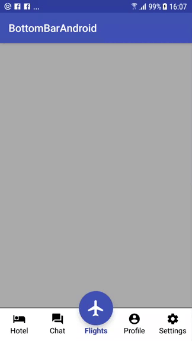

# BottomNavBar

[](https://travis-ci.org/jitinsharma/BottomNavBar)

A bottom navigation bar for Android with a primary floating button




# Integration

Artifacts are available at jcenter.

[ ](https://bintray.com/jitinsharma/bottomnavbar/bottomnavbar/_latestVersion)

Add following dependency

```gradle
compile 'io.github.jitinsharma:bottomnavbar:x.y.z'
```

# Usage

Add following code in layout xml
```xml
<io.github.jitinsharma.bottomnavbar.BottomNavBar
        android:id="@+id/bottomBar"
        android:layout_width="match_parent"
        android:layout_height="wrap_content"
        app:primary_txt_color="@color/colorPrimaryDark"
        app:primary_btn_bg="@color/colorPrimary"
        app:secondary_txt_color="@color/colorAccent"
        app:secondary_item_clicked="@color/clickColor"
        app:line_color="@color/colorPrimaryDark">
</io.github.jitinsharma.bottomnavbar.BottomNavBar>
```

### Initialization in Kotlin
```kotlin
fun init(primaryNavObject: NavObject, secondaryNavObjects: List<NavObject>, listener : (position : Int, primaryClicked : Boolean) -> Unit)

primaryNavObject - Object for center/floating button

secondaryNavObjects - List of objects for other buttons on the strip. The size of this list should be 2 or 4

listener - Callback for button click
```

### Example
```kotlin
val bottomBar = findViewById<BottomNavBar>(R.id.bottomBar)
bottomBar.init(NavObject(
        name = "Search",
        image = ContextCompat.getDrawable(this, R.drawable.ic_flight_black_24dp)
), arrayListOf(
        NavObject(
                name = "Hotel",
                image = this.getDrawable(R.drawable.ic_hotel_black_24dp)),
        NavObject(
                name = "Chat",
                image = this.getDrawable(R.drawable.ic_forum_black_24dp)),
        NavObject(
                name = "Profile",
                image = this.getDrawable(R.drawable.ic_account_circle_black_24dp)),
        NavObject(
                name = "Settings",
                image = this.getDrawable(R.drawable.ic_settings_black_24dp))
)) { position, primaryClicked ->
    // position returns position of secondary button clicked
    // primaryClicked returns true if primary button is clicked and position returned is -1
}
```

Check example app for full usage.