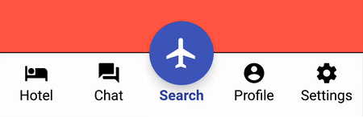
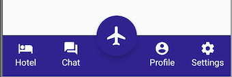

# BottomNavBar

A bottom navigation bar for Android with a primary floating button






# Usage

```kotlin
val bottomBar = findViewById<BottomNavBar>(R.id.bottomBar)
bottomBar.init(NavObject(
        name = "Search",
        image = ContextCompat.getDrawable(this, R.drawable.ic_flight_black_24dp)
), arrayListOf(
        NavObject(
                name = "Hotel",
                image = this.getDrawable(R.drawable.ic_hotel_black_24dp)),
        NavObject(
                name = "Chat",
                image = this.getDrawable(R.drawable.ic_forum_black_24dp)),
        NavObject(
                name = "Profile",
                image = this.getDrawable(R.drawable.ic_account_circle_black_24dp)),
        NavObject(
                name = "Settings",
                image = this.getDrawable(R.drawable.ic_settings_black_24dp))
)) { position, primaryClicked ->
    makeTopSnackBar("Index: $position Primary: $primaryClicked")
}
```