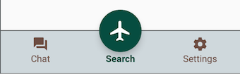

# BottomNavBar

A bottom navigation bar for Android with a primary floating button




# Usage

```kotlin
val bottomBar = findViewById<BottomNavBar>(R.id.bottomBar)
bottomBar.init(NavObject(
        name = "Search",
        image = ContextCompat.getDrawable(this, R.drawable.ic_flight_black_24dp)
), arrayListOf(
        NavObject(
                name = "Hotel",
                image = this.getDrawable(R.drawable.ic_hotel_black_24dp)),
        NavObject(
                name = "Chat",
                image = this.getDrawable(R.drawable.ic_forum_black_24dp)),
        NavObject(
                name = "Profile",
                image = this.getDrawable(R.drawable.ic_account_circle_black_24dp)),
        NavObject(
                name = "Settings",
                image = this.getDrawable(R.drawable.ic_settings_black_24dp))
)) { position, primaryClicked ->
    // position returns position of secondary button clicked
    // primaryClicked returns true if primary button is clicked
    // and position returned is -1
}
```


```xml
<io.github.jitinsharma.bottomnavbar.BottomNavBar
        android:id="@+id/bottomBar"
        android:layout_width="match_parent"
        android:layout_height="wrap_content"
        app:primary_txt_color="@color/colorPrimaryDark"
        app:primary_btn_bg="@color/colorPrimary"
        app:secondary_txt_color="@color/colorAccent"
        app:secondary_item_clicked="@color/clickColor"
        app:line_color="@color/colorPrimaryDark">
</io.github.jitinsharma.bottomnavbar.BottomNavBar>
```